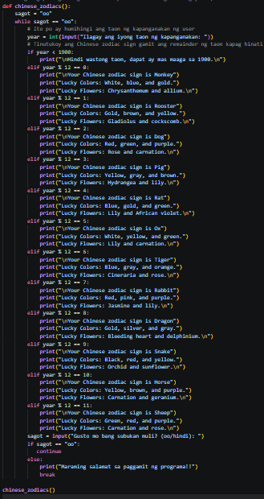
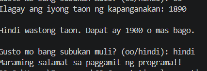
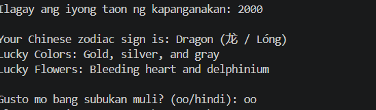

# Activity 3 - Chinese Zodiac

## Description

This program determines the Chinese Zodiac sign based on the user's birth year.

## Requirements

- The baseline year is 1900.
- The birth year must not be earlier than 1900.
- The program uses a 12-year repeating zodiac cycle.
- Only the birth year is considered.

## Chinese Zodiac Signs

1. Rat (鼠 / Shǔ)
2. Ox (牛 / Niú)
3. Tiger (虎 / Hǔ)
4. Rabbit (兔 / Tù)
5. Dragon (龙 / Lóng)
6. Snake (蛇 / Shé)
7. Horse (马 / Mǎ)
8. Goat (羊 / Yáng)
9. Monkey (猴 / Hóu)
10. Rooster (鸡 / Jī)
11. Dog (狗 / Gǒu)
12. Pig (猪 / Zhū)

## Code

## Screenshot of the Program's Output

### Kapag ang taon na inilagay ay mas maaga pa sa 1900

### Kapag wasto ang taong inilagay

